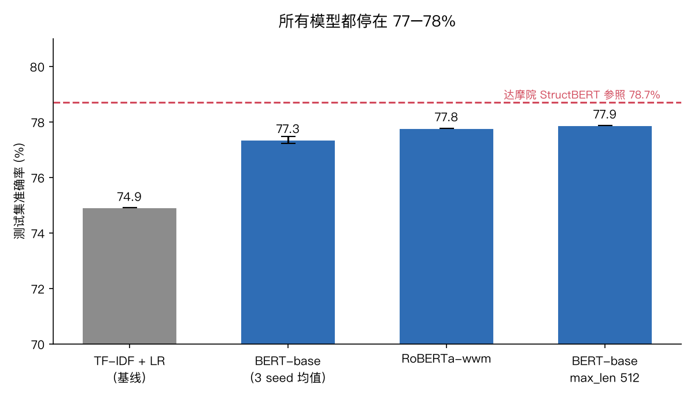
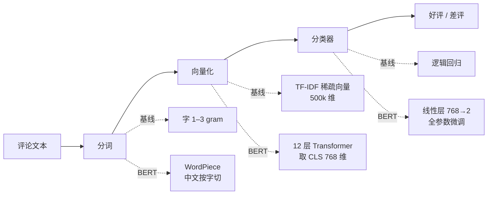
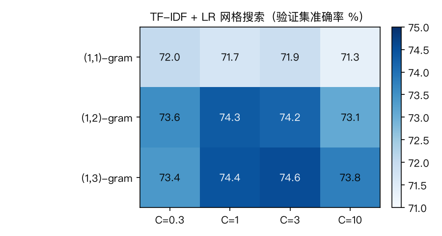
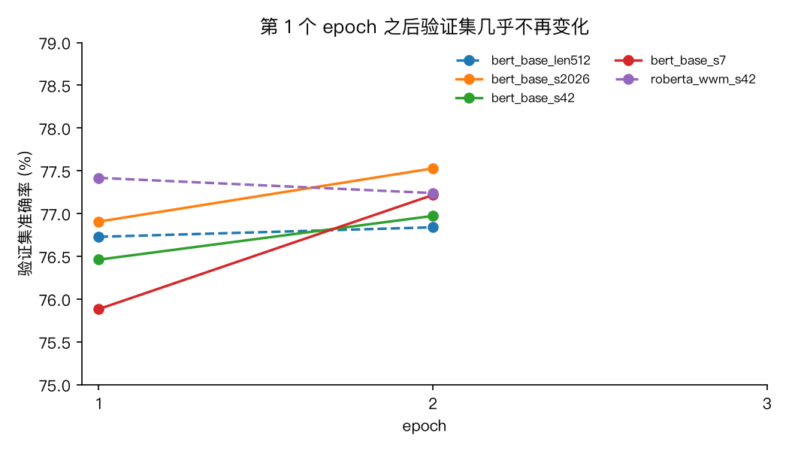
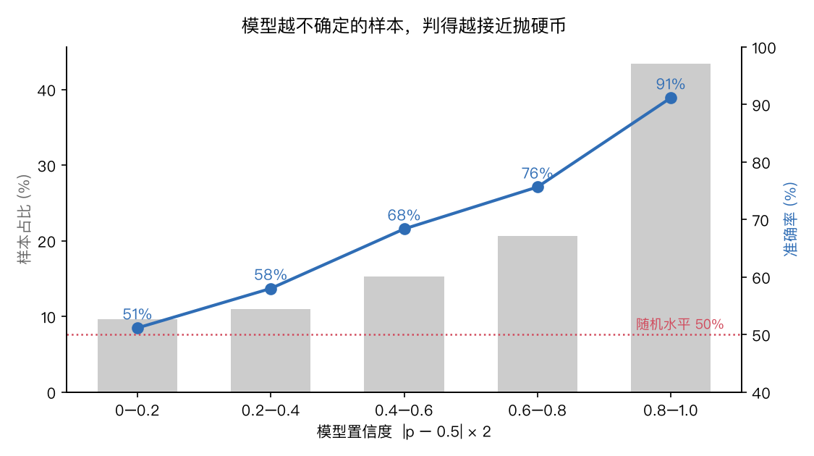
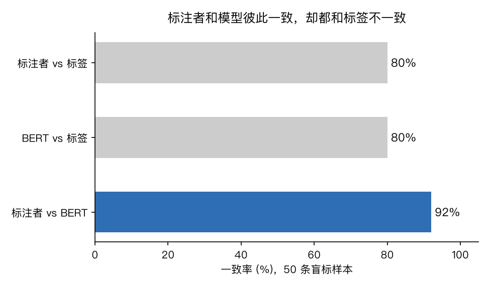

# 大众点评评论情感分类：BERT 能做到多好，以及为什么做不到更好

> 基于 `bert-base-chinese` 微调的中文评论二分类。基线 74.9%，BERT 77.3%，达摩院官方模型 78.7%——所有方法都挤在一个 4 个点的窄带里。这个项目做了两件事：**把 BERT 微调完整做一遍，然后弄清楚天花板到底是模型还是数据。**

<p align="center"></p>

---

## 1. 数据：一份看起来简单、实际很"脏"的评论集

数据来自魔搭 [DAMO_NLP/yf_dianping](https://modelscope.cn/datasets/DAMO_NLP/yf_dianping)，原始数据是张永锋等人 WWW 2013 的大众点评推荐数据集，达摩院从中抽取了一个二分类子集。

| 项目 | 数值 |
|---|---|
| 训练 / 官方 dev | 44,984 / 5,016 条 |
| 类别分布 | 好评 49.9% / 差评 50.1%，完全平衡 → 指标用准确率 |
| 文本长度（字符） | 中位数 98，90 分位 281，99 分位 814，最长 2,033 |
| 数据质量 | 无重复、无空文本、train/dev 无重叠 |
| 标签定义 | **未公开**。README 和元数据都没写星级如何映射到 0/1 |

三份数据的分工：

```
train.csv (44,984)
 ├── 90% → 训练集 (40,485)        学参数
 └── 10% → 内部验证集 (4,499)     调超参、选 epoch，分层抽样，seed 42
dev.csv   (5,016) → 测试集        只在最后评估一次，不参与任何决定
```

翻数据时的第一个信号：`label=0` 里有不少这样的评论——

> "我喜欢喝粥，这的甜粥和咸粥……我都喜欢喝。就是上菜的速度超慢，价钱不便宜。"

通篇在夸，只有一句抱怨，标签是差评。这类样本不是个例。合理的推测是**3 星及以下都被归为了负类**，"总体满意但有一处不满"的评论大量落在了 0 里。后面所有分析都从这个观察出发。

---

## 2. 方法：从词袋到 BERT



### 2.1 传统基线：TF-IDF + 逻辑回归

字级 n-gram TF-IDF 向量化，逻辑回归分类。词表和 IDF 只在训练集上拟合。对 n-gram 范围和正则强度 C 做了 12 组网格搜索，按验证集选最优：

<p align="center"></p>

2-gram 比 1-gram 高 2.5 个点（"不好""难吃"这类搭配确实有用），3-gram 只再加 0.2。C=10 全线下滑——50 万特征对 4 万样本，正则一松就开始记训练集。**词袋模型的天花板在 74.6% 左右。**

### 2.2 BERT 微调

| 设置 | 取值 | 为什么 |
|---|---|---|
| 主干 | `bert-base-chinese`，1.02 亿参数 | 作业要求；中文按字切，无 OOV |
| 分类头 | `[CLS]` 输出 → 768→2 线性层 | 随机初始化，与主干一起训练 |
| 学习率 | 2e-5，前 10% 步 warmup，之后线性衰减 | 预训练参数只能小步调，warmup 保护主干不被随机分类头的大梯度冲坏 |
| 优化器 | AdamW，weight decay 0.01，LayerNorm 和 bias 不衰减 | 标准做法 |
| 序列长度 | 256，动态 padding | 覆盖约 88% 样本不截断；512 作为对照 |
| batch / epoch | 32 / 2 | 第 3 个 epoch 已验证无收益 |
| 精度 | bf16 混合精度，梯度裁剪 1.0 | H200 上每 epoch 44 s |

训练循环手写（不用 `Trainer`），每个 epoch 在内部验证集上评估，保留最优参数，最后在测试集上评估一次。

---

## 3. 结果

### 3.1 主表

| 模型 | 验证集 | 测试集 | 说明 |
|---|---|---|---|
| TF-IDF char 1–3gram + LR | 74.55% | 74.90% | 网格搜索最优 |
| **bert-base-chinese，3 seed 均值** | 77.24% | **77.34% ± 0.13** | seed 42 / 7 / 2026 |
| chinese-roberta-wwm-ext | 77.42% | 77.77% | 换更强的预训练权重 |
| bert-base-chinese，max_len 512 | 76.84% | 77.87% | 长评论不截断，训练时间 ×2 |
| StructBERT-base（达摩院，外部参照） | — | 78.69% | 四个情感数据集共 11.5 万条联合微调 |

三个 seed 的测试集结果 77.43 / 77.41 / 77.19，标准差 0.13。**结果稳定，但所有配置都停在 77–78%。** 换预训练模型、放宽截断、加三倍数据，各自只带来半个点以内的变化。

### 3.2 训练曲线

<p align="center"></p>

五次独立训练，验证集准确率在第 1 个 epoch 之后就基本不动了。与此同时训练 loss 持续下降（0.48 → 0.42 → 0.35），说明模型后面是在记训练集，而不是在学新东西。更值得注意的是**训练 loss 的绝对值**：五次训练第 2 个 epoch 全部停在 0.40–0.43，干净的情感数据上 BERT 通常能压到 0.1 以下。有一批样本，任何配置都拟合不上。

---

## 4. 天花板在哪：三个独立实验指向同一个答案

BERT 比词袋基线只高 2.4 个点，这个差距小得可疑。要么是模型没训好，要么是数据本身有上限。下面三个实验从不同角度回答。

### 4.1 模型自己知道哪些样本判不了

把内部验证集按模型置信度 $|p - 0.5| \times 2$ 分成五档：

<p align="center"></p>

| 置信度 | 样本占比 | 准确率 |
|---|---|---|
| 0.0–0.2 | 9.6% | **51.2%** |
| 0.2–0.4 | 11.0% | 58.0% |
| 0.4–0.6 | 15.3% | 68.4% |
| 0.6–0.8 | 20.6% | 75.6% |
| 0.8–1.0 | 43.5% | **91.2%** |

单调递增，最低档正好是抛硬币。约 20% 的样本模型"不确定"，而这部分的准确率就是随机水平；高置信的 43.5% 样本准确率 91%。如果标签是干净的、只是模型能力不足，低置信区间通常会落在 65–70%，不会精确地卡在 50%。

### 4.2 独立标注者和模型高度一致，却都和标签不一致

从验证集随机抽 50 条，隐藏标签，由独立标注者（LLM）按"整体上是否推荐这家店"标注，然后三方对比：

<p align="center"></p>

标注者和 BERT 彼此一致率 92%，但各自和数据集标签只有 80%。10 条标注者与标签不一致的样本里，**8 条 BERT 站在标注者这边**。标注者对 18 条（36%）表示难以二分。几个典型样本：

| 标签 | 标注者 | BERT | 评论 |
|---|---|---|---|
| 差评 | 好评 | 好评 (0.81) | 经常到这里来吃饺子，锅贴也不错，三鲜馅的很好吃。价格也比较便宜……就是店小人多，服务员忙不过来 |
| 差评 | 好评 | 好评 (0.87) | 很有重庆老火锅的感觉～老板也是重庆人～很地道……就是价格有点小贵 |
| 好评 | 差评 | 差评 (0.06) | 北海道面包做的越来越干了，觉的奶味不浓了！……其它的一般了 |

这和"3 星及以下归为负类"的推测完全对得上：写评论的人打了 3 星，标签就是 0，但文本读起来是满意的。

### 4.3 外部参照：达摩院也没过 80%

达摩院的 StructBERT 情感模型在同一数据集上报 78.69%。同一个模型、同一套方法，在京东评论上是 92.1%，在外卖评论上是 91.5%。**只有点评数据停在 79% 以下。**

### 结论

<table>
<tr><td width="50%">

**证据链**

1. 验证集在第 1 个 epoch 后不再变化，训练 loss 卡在 0.4
2. 五种配置全部落在 77–78%
3. 低置信样本占 20%，准确率 = 随机
4. 独立标注者与模型 92% 一致，与标签 80% 一致
5. 达摩院官方模型 78.7%

</td><td>

**判断**

这份数据集上任何模型的上限约在 **78–79%**。约 20% 样本的标签与文本表达的情感不一致，人和模型都无法从文本中恢复。

BERT 相比词袋的 +2.4 个点，来自对转折句和整体态度的建模——这正是 2-gram 只能补一点点、词袋模型根本做不到的部分。要在这个数据上再往上走，方向不是更大的模型，而是处理标签噪声。

</td></tr>
</table>

---

## 5. 复现

```bash
uv sync
git clone https://www.modelscope.cn/datasets/DAMO_NLP/yf_dianping.git data/raw
uv run python -m src.download && uv run python -m src.stats

# 基线
uv run python -m src.baseline_tfidf
uv run python -m src.baseline_tfidf_grid

# BERT（GPU，每个约 2 分钟）
python -m src.train --epochs 2 --seed 42   --run bert_base_s42
python -m src.train --epochs 2 --seed 7    --run bert_base_s7
python -m src.train --epochs 2 --seed 2026 --run bert_base_s2026
python -m src.train --epochs 2 --model hfl/chinese-roberta-wwm-ext --run roberta_wwm_s42
python -m src.train --epochs 2 --max_len 512 --batch 16 --run bert_base_len512

# 分析与作图
uv run python -m src.confidence
uv run python -m src.sample_for_human && uv run python -m src.score_human
uv run python -m src.aggregate
uv run python -m src.plots
```

## 6. 目录

```
src/
  download.py / stats.py        数据读取与统计
  data.py                       划分、Dataset、动态 padding DataLoader
  baseline_tfidf*.py            词袋基线与网格搜索
  explore_bert.py               分词器与前向形状检查
  train.py                      BERT 微调，导出每条样本的预测与概率
  confidence.py                 置信度分档
  sample_for_human.py / score_human.py   盲标抽样与一致率
  aggregate.py / plots.py       汇总表与全部图片
results/                        每次实验的 json、预测 csv、汇总
docs/figs/                      README 用图，由 plots.py 生成
```
